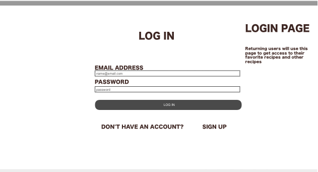
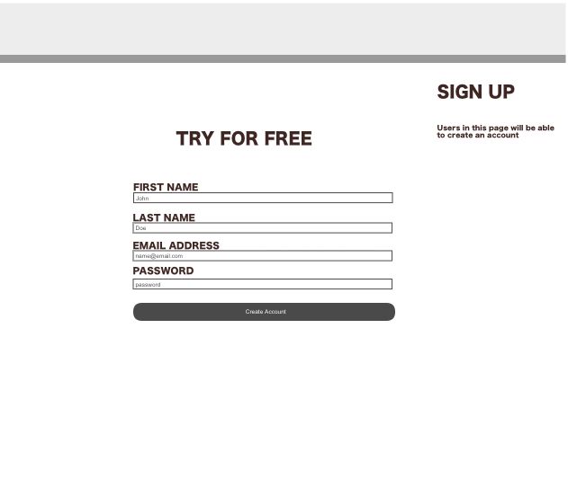
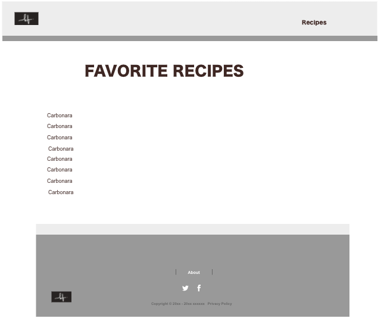
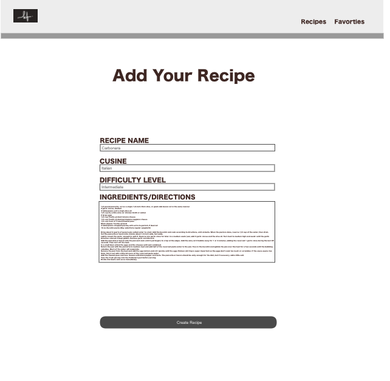
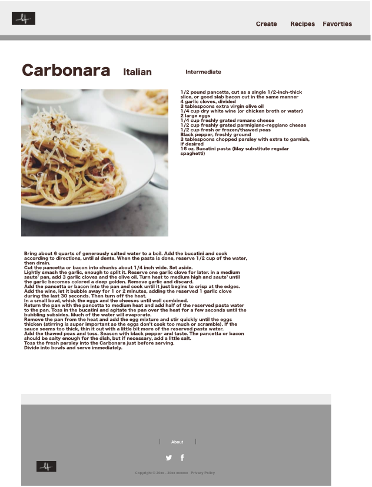
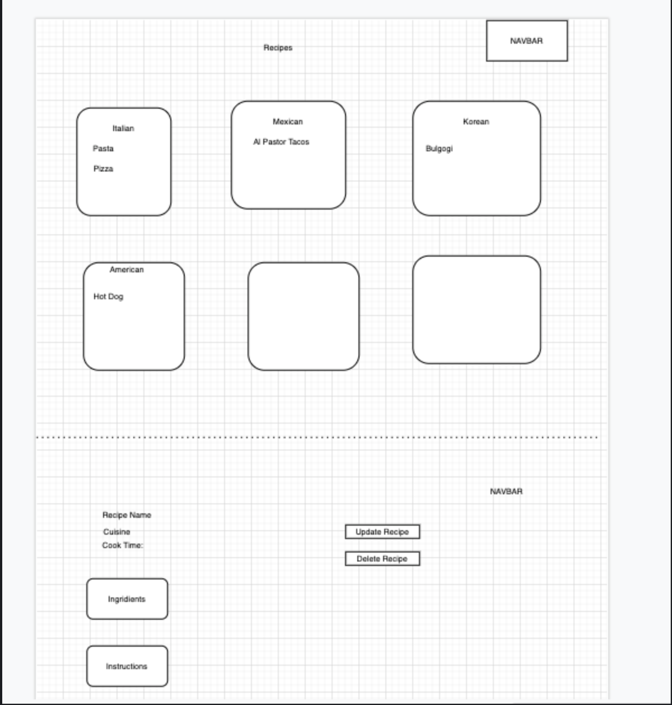
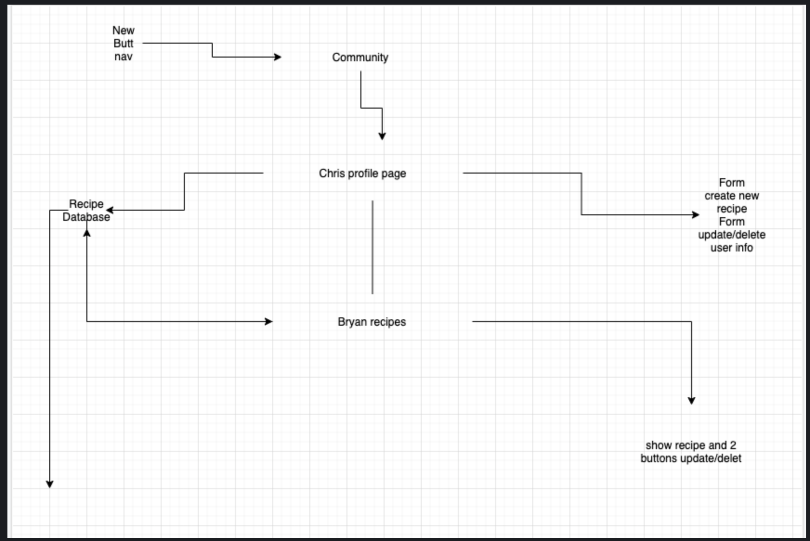

# Kitchen Fantasies
---

---
# User Story
---
## Game On!
- The user will have the option to name the character. Clicking the start button will begin the game.
- Once started the timer will then begin to increase vaules at different rates and amounts.
- Main objective to the game is to keep the values of eat, sleep and play below 10.
- Each time a button is press, a taco for food, a moon for sleep and a weight will animate and reduce the value by 1.
- Failure to do so results to your character to die.
- If successful, your character will evolve into Kadabra then Alakazam.

# Functionality
When the user clicks on the start game button. They will be directed to the Tamagatchi device page. At this page the timer will begin and display the seconds and mintues. The time is what drives this game. 

Eat: increases value by 1 every 5 sec
Sleep: increases value by 2 every 10 sec
Play: increases value by 3 every 15 sec
Age: increases value by 1 every  15 sec

Eat Button: -1, 
Sleep Button: -1, 
Play Button: -1

Abra will evolve to Kadabra once age reaches 5
Kadabra will evolve to Alakazam once age is 10

The game will end if the values exceed 10. The user will then be alerted with a reason that the character died. Then the page will reload and take you back to the begining.

# Wireframes

# Resources
- https://getbootstrap.com/docs/4.5/getting-started/introduction/
- https://www.colorhexa.com/
- https://www.w3schools.com/bootstrap/